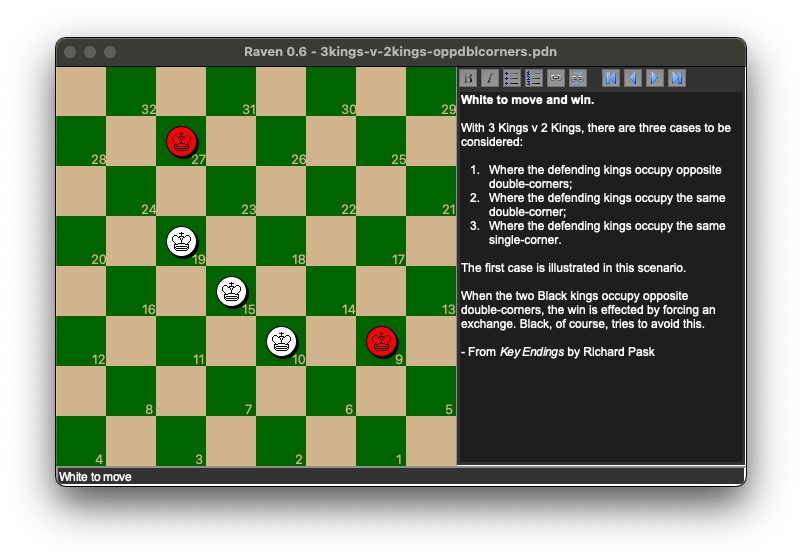

# Raven Checkers

## Project description

Raven is a checkers game program, for one or two players. While there are examples of excellent & free checkers programs out on the net (such as [Martin Fierz's Checkerboard](http://www.fierz.ch/checkers.htm)), Raven features are designed primarily for learning checkers, basic AI algorithms, and application design in Python.

* **Open-source code**. Raven uses existing open source code as a basis ([Martin Fierz's Simple Checkers evaluation function](http://www.fierz.ch/engines.php) and [Peter Norvig's search code from the AIMA project](http://aima.cs.berkeley.edu/python/readme.html)) for its AI engine. My own Python code is also open source.
* **Cross-platform**. Raven has been tested on Python 3.9-3.11 with Windows, OS X, and Linux, and that means the code itself is not locked into a particular operating system. The GUI is written with Python's built-in cross-platform GUI, Tkinter.
* **Great for checkers study**. Raven allows you to quickly set up board configurations using standard checkerboard notation. You can also describe your moves in the annotation window, and you can save and load games for later study. This is great for working through checkers books and learning techniques and tactics. If you have Portable Draughts Notation (.PDN) files with multiple games in them, Raven will prompt you for which game you want to load and review. (Look in the `training` directory for sample games and tutorials.)

## Prerequisites

* Python 3.9 or higher on your system.
* Install [PDM](https://pdm.fming.dev) on your system.
* From a command prompt in the project directory, type `pdm install --prod` to install project dependencies only, or `pdm install -G dev` to install both project and developer dependencies (like the pytest library, necessary for running unit tests).

## Running the program

* From a command prompt inside the project folder, type `pdm run python main.py`.

## Running unit tests

* From a command prompt inside the project folder, type `pdm run pytest`.
